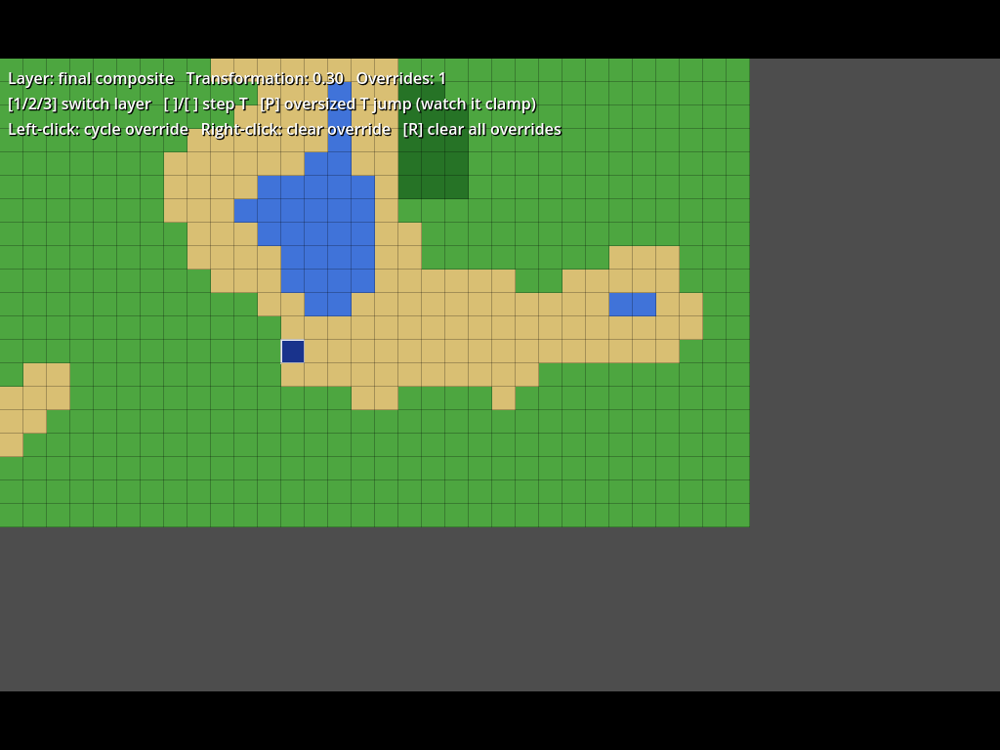

# Integrating ProcGen into a Godot project

This guide covers three things, in order: (1) dropping the engine into any Godot project by
copy-paste, (2) rendering generated maps with real tile art, and (3) visually debugging generation
without needing any art at all. Read them in order the first time — the debug overlay in step 3
doesn't require step 2, and is the fastest way to see the engine working in your own project.

## What you're copying

Two folders, both from this repository:

| Folder | What it is | Depends on Godot? |
|---|---|---|
| `engine/ProcGen.Engine/` | The generation engine itself | No — plain C#, this is the whole point |
| `godot/Integration/` | Renderer + debug-overlay helper scripts | Yes — these are the "thin consumer" glue |

You don't have to take `godot/Integration/` — the engine alone is fully usable without it, you'd
just be writing your own rendering code. Most people will want both.

## Step 1 — Copy-paste import

1. Copy `engine/ProcGen.Engine/` into your project, **excluding** `ProcGen.Engine.csproj`,
   `bin/`, and `obj/` — those exist only so this repo can build/test the engine standalone. Where
   you put it doesn't matter; `res://addons/ProcGenEngine/` or `res://Scripts/ProcGen/` both work.
   Only the `.cs` files matter.
2. Copy `godot/Integration/` (all of it) alongside it, e.g. `res://addons/ProcGenEngine/Integration/`.
3. That's it — no `.csproj` edits, no NuGet package, no project reference. Godot's C# SDK
   (`Godot.NET.Sdk`) compiles every `.cs` file under your project root into your project's single
   assembly by default, so the moment the files exist on disk, your project's next build picks
   them up.

This was verified for real during development: the exact same `engine/ProcGen.Engine/*.cs` files
were copied into a brand-new, unrelated Godot project with nothing but the default
`Godot.NET.Sdk` project template, and it built and ran with zero warnings and zero project-file
changes.

**If your project doesn't have C# enabled yet:** open it in the Godot editor once — Project
Settings will offer to enable C# support and generate a `.csproj`/`.sln` the first time it sees a
`.cs` file, or you can enable it via Project → Tools → C#.

**A note on staying in sync:** this is a source copy, not a package reference — if the engine
changes upstream, you re-copy the two folders. That's the tradeoff of "copy-paste is sufficient to
import it." If you'd rather have a dependency you can `git pull` (via a git submodule, or a
private NuGet package once the engine stabilizes), that's a reasonable next step, just not what
was asked for here.

## Step 2 — Minimal usage (no rendering yet)

```csharp
using ProcGen.Engine.Generation;
using ProcGen.Engine.Model;
using ProcGen.Engine.Overrides;

var ground = new LayerDef(
    "ground",
    new List<TileDef>
    {
        new TileDef("deep_water", 0.7),
        new TileDef("shallow_water", 0.3),
        new TileDef("sand", 0.2),
        new TileDef("land", 2.0),
    },
    new List<WritesOverRule>(),                 // base layer: no filter, always eligible
    new SeedPosition(1000.37, 2000.81, 0.0),     // this layer's independent X/Y/Transformation seed
    new NoiseParams { Octaves = 3, Frequency = 0.05 });

var def = new MapDefinition { WorldSeed = 12345 };
def.Layers.Add(ground);

var overrides = new OverrideStore();
overrides.Set("ground", worldX: 10, worldY: 4, tileId: "land"); // a hand-painted tile, if you have one

var region = new RegionSpec(originX: 0, originY: 0, width: 32, height: 20, transformation: 0.0);
MapResult result = MapGenerator.GenerateRegion(def, region, overrides);

string? tile = result.GetFinalTile(localX: 0, localY: 0); // e.g. "land"
```

Everything in `Model`/`Generation`/`Overrides`/`Selection`/`Noise`/`Validation` is engine surface —
call it the same way from editor-tool code and game code, since it's the same assembly either way.

## Step 3 — Visual debugging (no art required)

This is the fastest way to see the engine actually working in your project — no `TileSet`, no
imported textures, just flat colors per tile id.

1. Add a `Node2D` to a scene and attach `Integration/ProcGenDebugOverlay.cs`.
2. In your own script, feed it a color per tile id and a generation result:

```csharp
var overlay = GetNode<ProcGenDebugOverlay>("Overlay");
overlay.SetTileColors(new Dictionary<string, Color>
{
    ["deep_water"] = new Color(0.10f, 0.20f, 0.55f),
    ["land"] = new Color(0.45f, 0.35f, 0.20f),
    // ...one entry per tile id you use. Unmapped tile ids render as loud magenta on purpose --
    // that's your signal you forgot one.
});

var result = MapGenerator.GenerateRegion(def, region, overrides);
overlay.Render(result, region, overrides);
```

3. Call `overlay.ShowLayer("ground")` / `overlay.ShowLayer("ground_cover")` / `overlay.ShowLayer(null)`
   to switch between a single layer's raw resolution and the final composited view — this is the
   "toggleable layer visibility for debugging" from the original spec, in its simplest useful form.
4. Cells with a manual override get a white outline automatically (via `GetFinalLayerId`, which
   tells the overlay which layer actually produced the visible tile, so it knows which layer's
   override to check) — overrides are visually distinct from procedural output without any extra
   wiring on your part.
5. `overlay.LocalPositionToCell(overlay.GetLocalMousePosition())` converts a click into an
   absolute world cell (or null if that cell isn't part of whatever region was last rendered), so
   wiring up click-to-paint is a few lines:

```csharp
var cell = overlay.LocalPositionToCell(overlay.GetLocalMousePosition());
if (cell != null)
{
    overrides.Set("ground", cell.Value.X, cell.Value.Y, "land");
    var result = MapGenerator.GenerateRegion(def, region, overrides);
    overlay.Render(result, region, overrides);
}
```

The overlay always draws (and reports click positions) in absolute world-cell coordinates, not
positions relative to the rendered region's origin -- world cell `(wx, wy)` always draws at pixel
`(wx * CellPixelSize, wy * CellPixelSize)` in the overlay's own local space, regardless of which
region is currently loaded. That's what lets a consumer freely pan/zoom a camera around the
overlay (by transforming a parent `Node2D`, as `MapEditorToolScene` does) without needing to
reposition the overlay itself every time a different region gets generated -- see "Camera: pan,
zoom, and the designated area" in the README for the fuller picture, including
`ProcGenDebugOverlay.DesignatedArea` for dimming content outside a map's "real" boundary.

**A working example of all of this** is in this repo at `godot/Scripts/VisualDebugDemoScene.cs` /
`godot/Scenes/VisualDebugDemo.tscn` — open the scene in the Godot editor and press F6 (Run Current
Scene) to try it interactively. Controls:

- `1` / `2` / `3` — view layer `ground` / `ground_cover` / the final composite
- `[` / `]` — step Transformation by ∓0.1
- `P` — attempt an oversized +1.0 Transformation jump, to watch it clamp to +0.1 live
- Left-click — cycle the override at that cell through the viewed layer's tile list
- Right-click — clear the override at that cell
- `R` — clear all overrides

This was run and driven with real synthetic input (via `xdotool`, under Xvfb + software OpenGL)
during development to confirm the whole loop actually works end-to-end, not just that it compiles.
Sample frame:



*(Colors: blue = water, tan = sand, brown = land, greens = grass/tallgrass/dirt. The dark-blue
outlined cell near the bottom-left of the lake is a hand-painted override — click-painted during
the verification run — showing as `deep_water` in the final composite even though the ground_cover
layer would otherwise have put grass there.)*

## Step 4 — Rendering with real tile art

Once you have actual tile art, swap (or add to) the debug overlay with `ProcGenTileMapView`, which
paints into a real `TileMapLayer`:

1. **Build a `TileSet` resource** in the Godot editor: create a `TileMapLayer` node, assign it a
   new `TileSet`, add your tile atlas texture as a source, and use the TileSet editor's tile
   painter to note down the atlas coordinates of each tile you'll use (hover a tile in the TileSet
   panel — its atlas coordinates show in the tile inspector, e.g. `(0, 0)`, `(1, 0)`, `(2, 0)`...).
2. **Add a `ProcGenTileMapView`** node (a `Node2D`, attach `Integration/ProcGenTileMapView.cs`),
   and assign its `TargetTileMap` export to your `TileMapLayer`.
3. **Map every engine tile id to its atlas coordinates** in code:

```csharp
var view = GetNode<ProcGenTileMapView>("TileMapView");
view.TargetTileMap = GetNode<TileMapLayer>("TileMapLayer");
view.TileAtlasCoords = new Dictionary<string, Vector2I>
{
    ["deep_water"] = new Vector2I(0, 0),
    ["shallow_water"] = new Vector2I(1, 0),
    ["sand"] = new Vector2I(2, 0),
    ["land"] = new Vector2I(3, 0),
    // ...
};
```

4. Call `view.Render(result, region)` after each `MapGenerator.GenerateRegion(...)` call, same as
   the debug overlay. World cell `(region.OriginX + x, region.OriginY + y)` is used as the
   `TileMapLayer` cell coordinate, so regions painted at different origins line up correctly
   without any extra offsetting on your part.
5. If a tile id has no atlas mapping, `ProcGenTileMapView` logs a `GD.PushWarning` and skips that
   cell rather than crashing — useful while you're still filling in art.

Nothing stops you from running the debug overlay *and* the tile map view side by side (e.g. debug
overlay on top, semi-transparent, toggled with a key) — they're independent consumers of the same
`MapResult`, which is the whole point of the engine/consumer split.

## Notes for the editor tool specifically

Everything above works identically whether it's driven by gameplay code or by editor-tool code —
that's the architectural guarantee from milestone 1.

`godot/Scenes/MapEditorTool.tscn` / `Scripts/MapEditorToolScene.cs` is a working reference for a
full map-making tool: a fixed side panel (designated-area origin/size, Transformation, a layer
picker, the selected layer's seed X/Y/T, and the selected layer's tiles -- each with a
`ColorPickerButton` swatch, manual-entry range + `-`/`+` nudge buttons, and a remove button, plus
an "Add Tile" field/button below the list) driving live regeneration, plus a free mouse-wheel-zoom
/ click-drag-pan camera over the generation space with the designated area rendered dimmed-outside
(via `ProcGenDebugOverlay.DesignatedArea`), a coordinate readout, and a "Return to Map Area"
button. Every field/gesture writes straight into a live `MapDefinition`/`OverrideStore` and calls
`MapGenerator.GenerateRegion` again against whatever's currently visible -- there's no separate
"tool state" that could drift from what actually gets generated. It's built entirely from Godot
`Control`/`Node2D` nodes constructed in code (no Inspector/editor-plugin dependency), so it runs
the same way whether it's a standalone tool scene (as here) or embedded in a bigger editor UI.
Tile color is tracked per tile id in the tool (not on the engine's `TileDef`, since it's a
rendering concern) and stands in for tile art until real art exists. See its doc comment and the
README's "The map editor tool" section for screenshots and the full control layout.

Save/load, a map id field, and entrance/exit point editing are built -- see "Save/load and
entrance/exit points" in the README. Saving goes through
`ProcGen.Engine.Serialization.MapFileSerializer`, the same reader/writer a game must use to load a
map back; nothing editor-only (tile display colors, camera state) is part of the saved format.

Still not built, per the milestone-1 scope ("Deferred by design" in the root `README.md`):
- Add/remove layers (tiles can already be added/removed per layer), and reordering layers, tiles,
  or `writes_over` filter editing.
