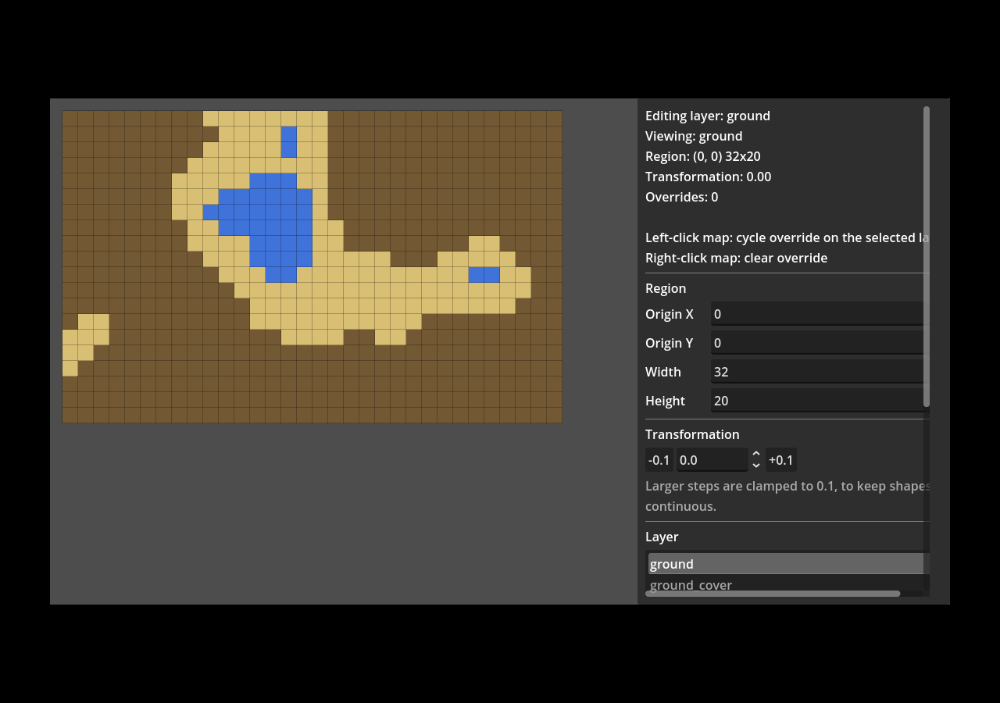
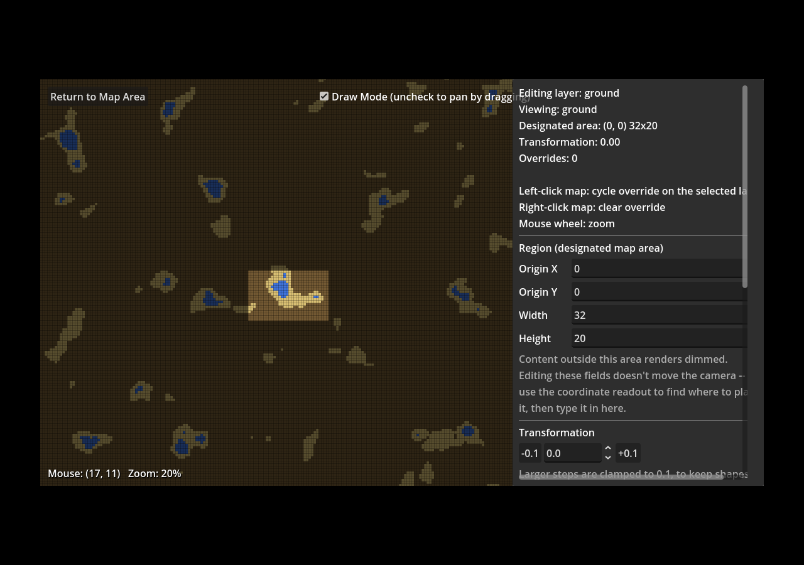

# Procedural Map Generation — Milestone 1 + integration package

Core mechanics for the procedural map generation system, proven end-to-end, plus a copy-paste
integration package for dropping the engine into any Godot project. See "Confirmed decisions"
below for the architecture questions this raised before implementation started, and
**[`INTEGRATION.md`](INTEGRATION.md)** for how to bring this into your own project, render it with
real tile art, and visually debug it.

## Layout

```
engine/ProcGen.Engine/    The generation engine. Plain C# class library, net8.0, zero
                           dependency on Godot or any UI/editor code. This is the single
                           source of truth both the tool and the game call into. This is
                           also the folder you copy-paste into another Godot project --
                           see INTEGRATION.md.
tests/ProcGen.Engine.Tests/  xUnit tests proving the milestone-1 acceptance criteria against
                           the engine directly (no Godot runtime needed to run these).
godot/                    Minimal Godot 4.4 C# project demonstrating both consumers:
  Integration/               Godot-dependent rendering/debug helpers (ProcGenTileMapView,
                              ProcGenDebugOverlay) -- the other copy-paste folder. Thin
                              consumers of the engine, not part of it.
  Scripts/Milestone1TestScene.cs   Headless console proof of the milestone-1 scenario.
  Scripts/VisualDebugDemoScene.cs  Interactive, on-screen demo: colored-cell rendering,
                                    click-to-paint overrides, Transformation scrubbing.
  Scripts/MapEditorToolScene.cs    The map-making tool: a fixed side property panel
                                    (region, Transformation, per-layer seed, per-layer tile
                                    ranges with manual entry + nudge buttons) driving live
                                    regeneration, plus click-to-paint on top, a "Maps in this
                                    project" list (New/Duplicate/Delete), and an "Edit: Map /
                                    Entrance-Exit / Project Overview" dropdown that swaps in a
                                    panel for this map's named entrance/exit points (with
                                    click-to-place canvas markers) or a project-wide summary
                                    that flags dangling exits. Save/Load read and write every
                                    map in the project at once as JSON via
                                    ProcGen.Engine/Serialization.
  Scripts/EntranceExitOverlay.cs   Draws the entrance/exit markers described above -- a pure
                                    visualization aid, no engine data flows through it.
docs/                     Reference screenshots for INTEGRATION.md / this README.
INTEGRATION.md            How to copy this into your own Godot project, render with real
                           tile art, and visually debug generation.
```

`ProceduralMapGen.sln` at the repo root ties all the C# projects together.

## Confirmed decisions

Three architectural questions were flagged in the spec as needing confirmation before writing
code. They were resolved as follows:

1. **Engine language: pure C#, no GDExtension.** The engine (`engine/ProcGen.Engine`) is a plain
   .NET class library with no reference to `GodotSharp` at all — it doesn't know Godot exists.
   Both the tool and the game reference it as an ordinary project/assembly reference. The "one
   engine, two thin consumers, can't drift apart" requirement is enforced by that assembly
   boundary rather than by a native/managed boundary: nothing UI- or editor-specific can leak into
   `ProcGen.Engine` because it can't call into `GodotSharp` even if someone tried.
2. **Noise construction: Perlin-style gradient noise with a quintic fade curve** ("improved
   noise"), extended to three axes (X, Y, Transformation) by treating Transformation as an
   ordinary third lattice axis interpolated exactly like X/Y. See
   `engine/ProcGen.Engine/Noise/LatticeNoise3D.cs`.
3. **Save/export format: JSON, read and written by the engine itself, one file per project (not
   per map).** Superseding the earlier plan of a Godot `Resource` adapter:
   `ProcGen.Engine.Serialization.ProjectFileSerializer` is the one reader/writer both the editor
   tool and the actual game call through, so "configuration + algorithm reproduces the map
   exactly" only depends on both consumers running the same engine assembly against the same file
   -- not on a Godot-specific adapter staying in sync with it. A project file *is* one whole game:
   it holds every map belonging to it (each a `MapDefinition`, including its id and its named
   entrance/exit points, plus its `OverrideStore` diff), and there is deliberately no way for an
   exit to reference a map in a *different* project file -- every valid destination is always
   available in-memory alongside the map that references it. That's also why map ids only need to
   be unique within a project, not globally. Nothing editor-only (e.g. the tool's tile display
   colors) is part of the format. See `MapDefinition.MapId`/`.Entrances`/`.Exits` and
   `ProjectFileSerializer.Serialize`/`.Deserialize`.

## Determinism

Same seeds + parameters + overrides → bit-identical output, verified twice: once by
`DeterminismTests` running the engine directly, and once live inside the actual Godot runtime by
the test scene (see "Running the milestone-1 test scene" below).

The cross-platform risk called out in the spec — native floating-point/library differences
between platforms — is addressed by construction:
- Gradient selection uses a pure-integer avalanche hash (unchecked 32-bit arithmetic, which .NET
  guarantees wraps identically on every platform/architecture it targets) into a small fixed table
  of gradient vectors, not a float-based hash.
- No trigonometric/transcendental functions (`Sin`, `Cos`, etc. — whose `libm` implementations can
  differ subtly across platforms) appear anywhere in the noise path.
- No fused-multiply-add is used (.NET does not auto-contract `+`/`*` into FMA; only an explicit
  `Math.FusedMultiplyAdd` call would introduce that risk).
- The only floating-point operations are `+ - * /` on `double`, which IEEE 754 defines exactly.

This reasoning is documented in `LatticeNoise3D`'s doc comment so it stays next to the code it
governs.

## Weighted-range tile selection

Implemented as a precomputed cumulative-bounds table (`Selection/CompiledLayer.cs`) plus a binary
search (`Selection/TileSelector.cs`) — mathematically equivalent to the spec's "sum ranges, walk
the list subtracting" description, just O(log n) instead of O(n) per cell. The selection result
exposes the continuous normalized value and the selected tile's bounds (not just the discrete tile
id), so a renderer can compute proximity to a range boundary and blend — the hook the spec asks
for, though the milestone-1 scene doesn't render a blended view yet.

Note: the spec's worked example states `0.7 + 0.3 + 0.2 + 2.0 = 2.2`; that sum is actually 3.2.
The engine implements the described *mechanism* correctly; tests use the correct sum. Worth
double-checking against your intended tile weights when you move past the example values.

## Layers and `writes_over`

`Generation/MapGenerator.cs` resolves a region cell-by-cell, layer by layer, bottom to top. Each
layer's `writes_over` rules are checked against a per-cell dictionary of every lower layer's
already-resolved (and already-override-applied) output — not just the immediately preceding
layer — so a layer can reference any lower layer by id. A layer with an empty `writes_over` list
is a base layer and is always eligible. Manual overrides are applied per layer as the final step,
regardless of whether the procedural filter matched, and the *post-override* value is what higher
layers see when evaluating their own filters — matching the composition order the spec asks for.

`writes_over` with multiple rules matches on **any** rule (logical OR) — the spec's examples only
show one rule per layer, so this is a documented design choice, not something pinned down by the
spec text.

## The map editor tool

`godot/Scenes/MapEditorTool.tscn` is the actual "map-making tool" from the spec: a fixed property
panel docked to the right, map view on the left, no hand-painting-every-tile required. Every field
writes straight into the live `MapDefinition`/`OverrideStore` the engine consumes and triggers
`MapGenerator.GenerateRegion` again — there's no separate "tool state" that could drift from what
actually gets generated.



Panel sections, top to bottom:
- **Region (designated map area)** — origin X/Y and width/height of the map that would actually
  get exported/used. Editing these fields does *not* move the camera (see below) — it only moves
  the dimming boundary, so you can look somewhere else and reshape the designated area to match
  without the view yanking away from what you're looking at.
- **Transformation** — `-0.1`/`+0.1` buttons plus a manually-editable field; both paths go through
  `TransformationAxis.ClampStep`, so typing an oversized jump gets clamped exactly like an
  oversized nudge would.
- **Layer** — click to choose which layer you're working on; also switches the map view to that
  layer's raw resolution (or check "Show final composite" to see the composited result instead).
- **Seed (selected layer)** — that layer's X/Y/T position in the generation lattice, freely
  editable.
- **Tiles (selected layer)** — one row per tile: a color swatch, id, a `-` button, a
  manually-editable range field, a `+` button (each nudge moving the range by 0.1), and an `x` to
  remove that tile. Below the list, a text field + "Add Tile" button appends a new tile (default
  range 1.0) to the selected layer. Changing any of this regenerates immediately.
  - The color swatch is a real `ColorPickerButton` — clicking it opens Godot's native color
    picker (RGB/HSV/hex, swatches, recent colors). Since there's no tile art yet, color is what
    represents a tile visually; a newly added tile gets an auto-assigned color (spread around the
    hue wheel so consecutive additions look distinct) that you can then repick.
  - Removing a tile (or adding one, or nudging any range) changes the layer's total weight, which
    reshuffles the cumulative selection bounds for *every* tile on that layer -- not just the one
    you touched. That's the weighted-range model working as specified (selection normalizes into
    `[0, sum of ranges)`), not a bug, but it means a small edit can visibly reshuffle tiles you
    didn't touch. `RangeSum` in `Selection/CompiledLayer.cs` is where this happens.
  - The last remaining tile on a layer can't be removed (the `x` button disables itself) --
    `CompiledLayer` requires at least one tile with positive total range, and `Regenerate()` now
    catches that `ArgumentException` and reports it in the status label instead of crashing, in
    case a layer's ranges are nudged all the way down to a zero total.

Above the panel sections described so far sits **Project** (a save file name field and Save/Load
buttons, acting on every map at once), **Maps in this project** (a list of every map in the
project with New/Duplicate/Delete, switching which map the rest of the panel edits), **Map** (just
the currently-selected map's id), and an **Edit: Map / Entrance-Exit / Project Overview** dropdown
that swaps everything below it between the panel just described, a second panel for this map's
named entrance/exit points, and a project-wide summary -- so those controls aren't cluttering the
view for maps that don't need them yet. See "Save/load, multiple maps, and entrance/exit points"
below.

Left-click on the map still cycles a manual override on the selected layer at that cell (same
mechanism as the visual debug demo); right-click clears it. Painting is the exception path for
when a setting alone can't express what you want — tuning ranges/seeds/region is meant to be how
you shape most of a map.

### Camera: pan, zoom, and the designated area

The generation space is treated as effectively infinite, and the map view is a free camera over
it rather than a fixed window onto one fixed region:



- **Mouse wheel** zooms in/out, centered on the cursor (the world point under the cursor stays
  under it as you zoom), clamped between 0.2x and 3x.
- **Draw Mode** (top-right checkbox, on by default) governs what left-click-drag does. On:
  left-click paints, same as always. Off: dragging pans the camera instead — this is the
  "scroll/drag the map around" navigation mode, deliberately gated behind the same toggle so you
  can't accidentally pan while trying to paint or vice versa.
- Whatever's on screen is generated live: every pan/zoom recomputes the visible world-cell
  rectangle and regenerates *that*, not the designated area — so panning to a distant, never-seen
  location shows freshly generated content immediately, same engine call as everywhere else.
  (Panning specifically skips the regenerate when the computed viewport hasn't actually changed
  cell-wise, since a mouse-drag can fire many motion events per pixel of movement; every other
  trigger — zoom, edits, painting — always regenerates unconditionally.)
- Cells outside the designated area render dimmed, with a bright border outlining exactly where it
  is, via `ProcGenDebugOverlay.DesignatedArea`. This is what makes "decide if you want to move the
  map origin" a visual decision: wander around with the mouse, read its coordinates off the
  bottom-left HUD, and type them into the Region fields once you've found where you want the map.
- **"Return to Map Area"** (top-left button) resets zoom to 1x and recenters the camera on the
  designated area — the escape hatch for when you've panned somewhere and lost track of it.

This was built and verified the same way as the rest of the tool consumers: run in the real Godot
4.4.1 editor under Xvfb + software OpenGL, driven with actual `xdotool` clicks, drags, and mouse
wheel events — zoomed out to the 0.2x limit and back, dragged the camera away and used "Return to
Map Area" to recover, watched a hand-painted override render dimmed after moving the designated
area away from it, and confirmed painting/clearing overrides and every panel control still work
correctly with the camera in play — not just built and assumed to work.

### Save/load, multiple maps, and entrance/exit points

**A project file is one whole game.** It holds every map belonging to it; there is deliberately no
way to load a single map out of a *different* project file, and an exit's destination is always
resolved against maps already in memory alongside it — never a cross-file lookup. That's the
entire reason map ids only need to be unique *within* a project, not globally: a reference to one
is always the pair (an exit's DestinationMapId, DestinationEntranceId), resolved inside the same
loaded project.

The **Project** section's file name field is separate from any individual **Map**'s id (below
it): the file name is only how the game engine locates the project on disk, the map id is how the
game refers to a map once the project is loaded. Save/Load act on
`res://Maps/<file name>.json` (the `.json` suffix is added for you if you leave it off) and cover
every map in **Maps in this project** at once, not just whichever one is currently selected.

The file is written and read by `ProcGen.Engine.Serialization.ProjectFileSerializer` — the same
reader/writer a game must call through, so a saved project reproduces identically wherever it's
loaded, given the same engine assembly. It holds a list of (`MapDefinition`, `OverrideStore` diff)
pairs, one per map -- nothing editor-only (the tool's tile display colors, camera position,
region/Transformation fields) is part of the format; those reset to defaults on load.

**Maps in this project** switches which map the rest of the panel edits. **New** starts a fresh
map from the same starter layout as a brand-new project; **Duplicate** deep-clones the selected
map's layers/tiles/entrances/exits (so editing the copy can never mutate the original) under a
generated-unique id; **Delete** removes it (a project always keeps at least one map).

Entrance and exit points are plain named markers on a map, edited from the panel behind the
**Edit: Entrance / Exit** dropdown option, and rendered as colored markers on the map canvas while
that panel is open (green for entrances, orange for exits) -- a **Place** button per point arms it
so the next map click sets its position, instead of typing coordinates blind.
- An **entrance** (id + X/Y) is where a player arrives after taking some exit — on this map or any
  other in the project — whose destination entrance id names it.
- An **exit** (id + X/Y + destination map + destination entrance) is where a player leaves
  through. The destination map/entrance are chosen from dropdowns populated with every map (and
  that map's entrances) already in the project — not typed as free text — so a fresh exit always
  points somewhere real by construction.
- Ids only need to be unique *within* their own map (checked on Add, and again by
  `ProjectFileSerializer.Deserialize` on load) — the map id half of an exit's destination pair is
  what's unique project-wide.

Exits can still go dangling after the fact (e.g. the destination map or entrance was since
deleted). The **Edit: Project Overview** panel lists every map with its layer/entrance/exit counts
and flags exactly that: every exit whose destination doesn't resolve within the project, via
`ProcGen.Engine.Validation.ProjectValidation.FindDanglingExits` — a diagnostic, not a hard error,
since a map under active construction may legitimately reference a destination you haven't built
yet.

## Running it

```bash
# Engine unit tests (46 tests, no Godot needed):
dotnet test tests/ProcGen.Engine.Tests/ProcGen.Engine.Tests.csproj

# Milestone-1 console proof, live inside real Godot (requires the Godot 4.4 mono/.NET editor binary):
cd godot
godot --headless --path .

# Interactive visual debugger (open in the editor and press F6, or run directly):
godot --path . res://Scenes/VisualDebugDemo.tscn

# The map editor tool -- property panel + live regeneration:
godot --path . res://Scenes/MapEditorTool.tscn
```

The headless scene prints an ASCII render of the generated region, the Transformation-axis
agreement percentages between T=0.0/0.1/0.2, the override + `writes_over` re-evaluation check, and
the determinism check — then exits with code 0 on success. This was run against the actual
Godot 4.4.1 mono editor binary during development; sample output:

```
Agreement T0.0 vs T0.1: 98.2 % (same style, gradually different arrangement)
Agreement T0.1 vs T0.2: 98.4 %
Cell (0,14) procedurally: ground=sand, ground_cover=(none)
After hand-painting ground=(0,14) -> land: ground_cover=grass (re-evaluated writes_over against the override)
PASS: regeneration is bit-identical.
```

The interactive scene was similarly run and driven with real synthetic input (via `xdotool`,
under Xvfb + software OpenGL) during development — see [`INTEGRATION.md`](INTEGRATION.md) for a
screenshot and the full walkthrough of what it demonstrates (layer switching, click-to-paint
overrides with a visible override marker, and the Transformation step clamp visibly capping an
oversized jump).

## Copy-paste integration package

`engine/ProcGen.Engine/` (minus its `.csproj`/`bin`/`obj`) and `godot/Integration/` are the two
folders meant to be copied into any other Godot project as-is — no project-reference plumbing, no
NuGet package. This was verified for real: those exact files were copied into a brand-new,
unrelated Godot project with nothing but the default C# template, and it built and ran with zero
warnings. Full walkthrough, including rendering with real tile art and the no-art-required visual
debugger, is in [`INTEGRATION.md`](INTEGRATION.md).

## Deferred by design (per "stop there" in the spec)

Not built yet, on purpose:

- More than 2 layers, and the `no_override` pseudo-tile.
- **Zones** (spatially-varying parameter overrides). Integration point to keep in mind: the
  resolution loop in `MapGenerator` currently compiles one `CompiledLayer` per `LayerDef` for the
  whole region. Zones will need the per-cell noise-parameters/tile-list lookup to become
  position-dependent (a zone's override merged over the layer's base parameters at that specific
  cell) rather than one fixed `CompiledLayer` per layer per region. The cell loop already resolves
  everything per-cell, so this should be a matter of swapping "look up this layer's compiled tile
  list" for "look up this layer's compiled tile list *at this position*" — not a restructure.
- In the editor tool specifically: add/remove layers (tiles can already be added/removed per
  layer), and reordering layers, tiles, or `writes_over` filter editing.
- Undo/redo, and multi-cell paint tools (brush size, fill, rectangle select) -- painting is
  currently one cell per click, same as milestone 1.
- Autosave / an unsaved-changes indicator.
